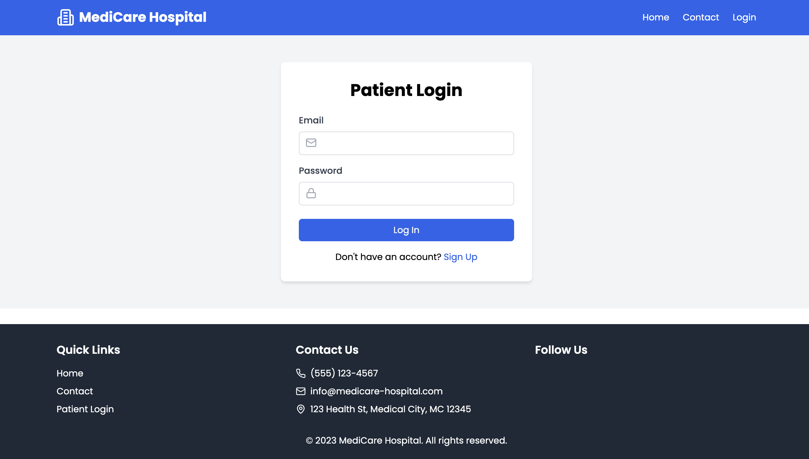
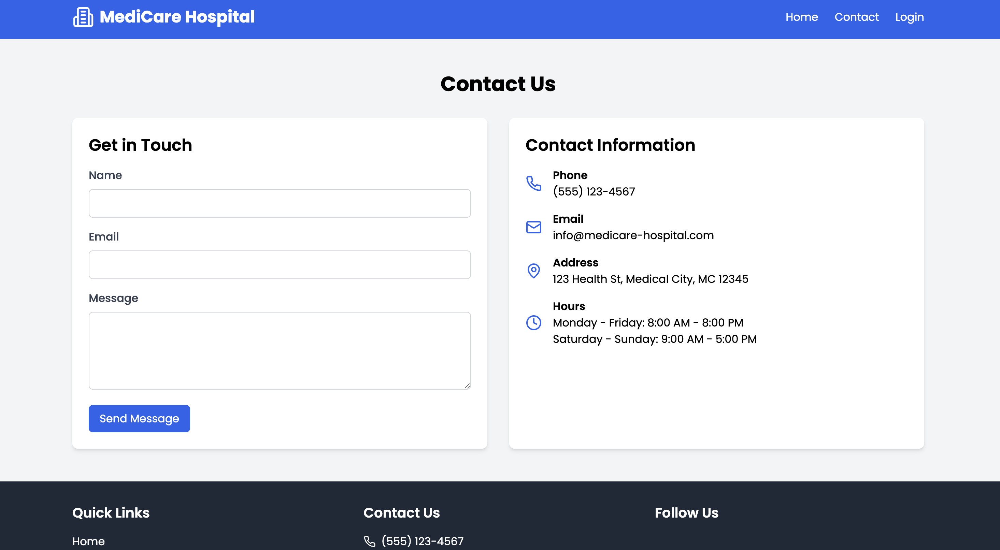
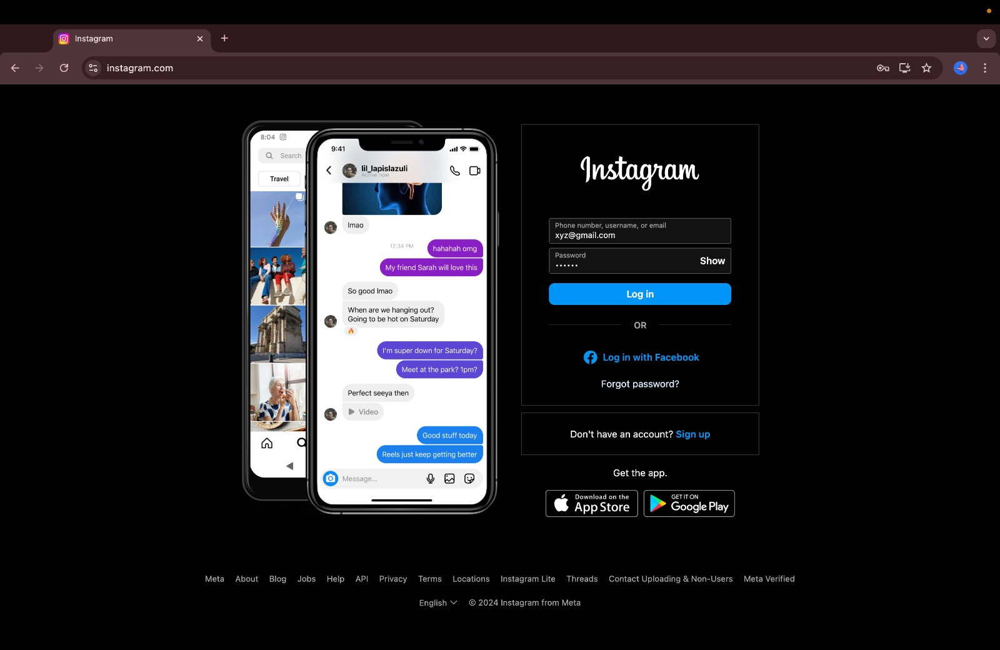
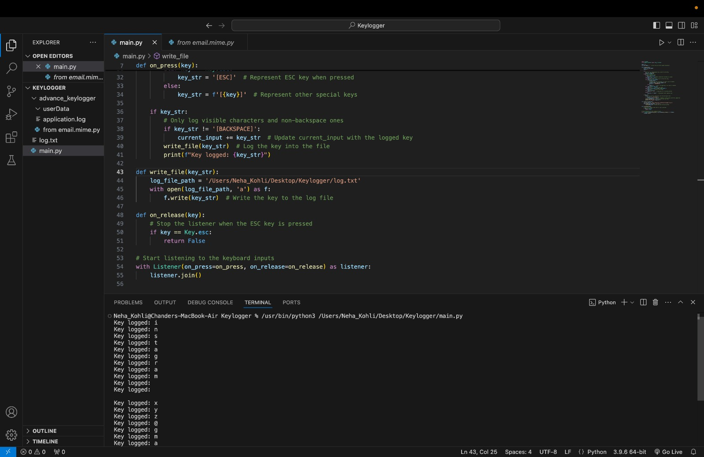

# 🔑 **Keylogger** 🔑

A simple and efficient keylogger designed to capture and log keystrokes. This project includes a **basic keylogger** that only captures keystrokes, and an **advanced keylogger** that captures screenshots, records the screen, and sends the logs to the authorities. This project is intended for educational purposes only. Please use responsibly and ensure you have proper permissions before use.

---

## 📝 **Table of Contents**

1. [Features](#features)
2. [Installation](#installation)
3. [Usage](#usage)
4. [Keylogger Types](#keylogger-types)
5. [Frontend Visualizations](#frontend-visualizations)
6. [Contributing](#contributing)
7. [Disclaimer](#disclaimer)
8. [License](#license)

---

## ✨ **Features**

- **Key Capture:** Records all keystrokes in real-time.
- **Advanced Keylogger:** Captures screenshots, records the screen, and sends logs to authorities.
- **Basic Keylogger:** Only captures keystrokes.
- **Time Logging:** Logs timestamps with each keypress for analysis.
- **Lightweight:** Minimal resource usage and simple to run.
- **Cross-Platform:** Compatible with most operating systems (Windows, Linux, macOS).
- **Customizable Output:** Logs can be saved in various formats, such as `.txt` or `.json`.
- **Secure Logging:** Advanced keylogger emails the log files to authorities.

---

## 🚀 **Installation**

### **Clone the Repository**

Start by cloning the repository to your local machine:

```bash
git clone https://github.com/codewidneha/Keylogger.git
cd Keylogger
```

### **Install Dependencies**

If your project uses Python, install the necessary libraries:

```bash
pip install -r requirements.txt
```

For other languages, follow their respective dependency management instructions.

---

## 🏃‍♂️ **Usage**

### **Running the Keylogger**

To start the keylogger:

- **For Python:**
  ```bash
  python keylogger.py
  ```

- **For Other Languages:**  
  Follow specific instructions based on the programming language used.

### **Stopping the Keylogger**

To stop the keylogger, press `Ctrl+C` in the terminal or close the application window.

---

## 🔑 **Keylogger Types**

### **1. Basic Keylogger**
The basic keylogger captures only the keystrokes pressed by the user. It’s lightweight and ideal for simple logging applications.

### **2. Advanced Keylogger**
The advanced keylogger not only captures keystrokes but also:
- Takes periodic **screenshots** of the user’s screen.
- **Records the screen** for further analysis.
- **Emails** the collected data (keystrokes, screenshots, and screen recordings) to a predefined recipient (such as the authorities).

---

## 🏥 **Frontend Visualizations**

In this project, I’ve also created two additional frontends to enhance the user experience:

1. **AuthApp Login Page**: A login page to test and visualize the keylogger functionality in a more interactive manner.
2. **Medicare Hospital Frontend**: A frontend interface for a hospital management system, aimed at providing a better visualization experience while interacting with the keylogger.

---

# Keylogger Project

## Screenshots

#### **1. AuthApp Login Page:**



#### **2. Medicare Hospital Frontend:**


#### **3. Keylogger Screenshots:**

**Basic Keylogger in Action:**


**Terminal Mode Keylogger:**


---

## 🤝 **Contributing**

We welcome contributions from the community! If you have suggestions for improvements, bug fixes, or new features, feel free to submit a pull request.

### **How to Contribute:**

1. **Fork the repository** to your own GitHub account.
2. **Create a new branch** for your feature (`git checkout -b feature-branch`).
3. **Make your changes** and commit them (`git commit -m 'Add new feature'`).
4. **Push to your branch** (`git push origin feature-branch`).
5. **Submit a pull request** with a description of the changes.

---

## ⚠️ **Disclaimer**

This tool is designed **for educational purposes only**. Unauthorized use, such as logging keystrokes without consent, is illegal and unethical. **Always obtain explicit permission before using keyloggers**. Misuse of this tool may lead to severe legal consequences.

---

## 📄 **License**

This project is licensed under the [MIT License](LICENSE). Feel free to use, modify, and distribute it as you see fit, but always abide by the terms.

---

## 💡 **Future Enhancements**

- **Encryption** for secure logging.
- **Remote Logging** to send logs to a secure server.
- **UI Interface** for easy management and configuration of the keylogger.


